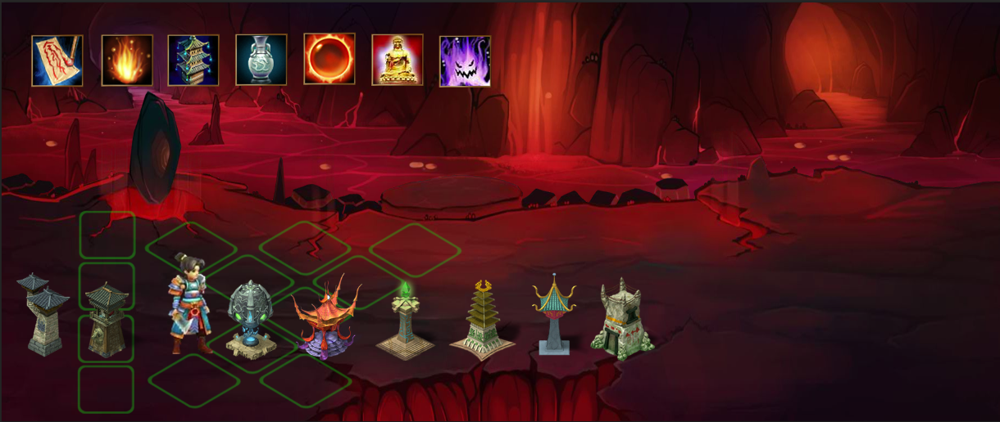

# CZServer 接口API设计 #

by 108km.com

### 修改记录 ###

---------------------------------------------------------------------

- 2013-01-07   Waigo    Initial version.
- 2013-01-07   Waigo    增加各个系统文档初稿.ToDo….
- 2013-01-20   Waigo    删除UniqUsers逻辑。简化用户系统。

# 目录 #

---------------------------------------------------------------------

- [用户系统 Users System](./users.md)
- [角色系统 Characters System](./characters.md) 
- [物品与装备系统 Props System](./props.md) 
- [战斗系统 Battles System](./battles.md)
- [护星系统 Star Guard System](guard_stars.md)
- [联盟系统 Union System](unions.md)
- [邮箱好友系统 Email & Friends System](./email_friends.md)

---------------------------------------------------------------------

# 游戏简介 #

#### 游戏玩法：
类似Battle Heart + 植物大战僵尸玩法。 

玩家控制1个角色，点击屏幕空白处移动，自动攻击敌人。 
在任务场景，玩家可以左右移动
在战斗场景，屏幕顶部会出现最多4个造塔的图标，点击拖拽该图标到场景的塔基上可以造塔。 

造塔： 
- 造塔需要消耗当前角色的魔法值。 
- 造塔有冷却时间，同一种塔不能连续造。
- 塔有时间限制，时间到了会爆掉。点击塔的时候显示剩余时间，浅蓝色的进度条。 

### 效果预览图

#### 经济系统： 

玩家游戏中可以积累的经济属性： 

- 铜钱 Coppers 游戏中可以获得。 
- 经验点数Skill Points（IAP购买） 
- 元宝Golds （IAP购买） 
 

#### 操作技巧的体现：

- 玩家首次通关可以一次性获得较多元宝和经验点数。之后重复玩的时候只能获得这个数字的1/5。 
- 玩家控制角色亲自杀死僵尸可以获得铜钱和经验点数（铜钱1或2，经验点1）。

- 

## 各大子系统 ##

---------------------------------------------------------------------
# 项目配置

在龙德办公室登陆：

### 数据库管理：

需要提前在公用Mac机器上启动mongoDB, 命令：  `sudo mongod`
数据库管理地址：
http://192.168.1.101:8080/rockmongo/

### 运行Web：

`node server.js`
网址：
 http://192.168.1.98:3000/
 http://localhost:3000/

### 项目的Git地址：

`https://用户名@bitbucket.org/waigo21/czserver.git`

名词解释：

**User**：统一的用户。

**ConstData**：数值常量。需要用大量的表来保持。譬如每个等级升级所需的金钱，不同等级的装备有不同的数值加成等等。

**str_key**：游戏里的所有资源的惟一识别符字段，字符串。用来在ConstData表里搜索相应的数值数据。譬如每个塔，每个装备，每个任务等等，都必须有这一个识别符字段。

-----------------------------------------------------------------
